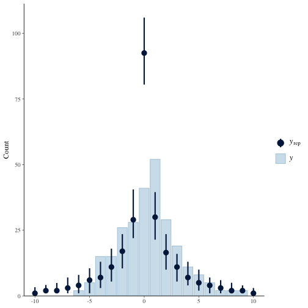
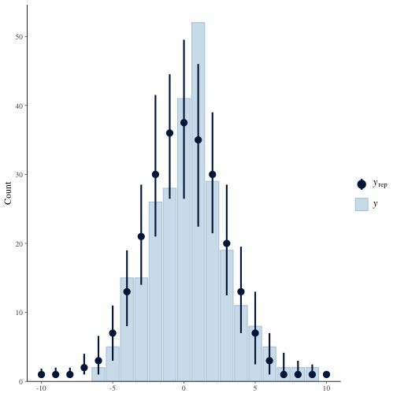
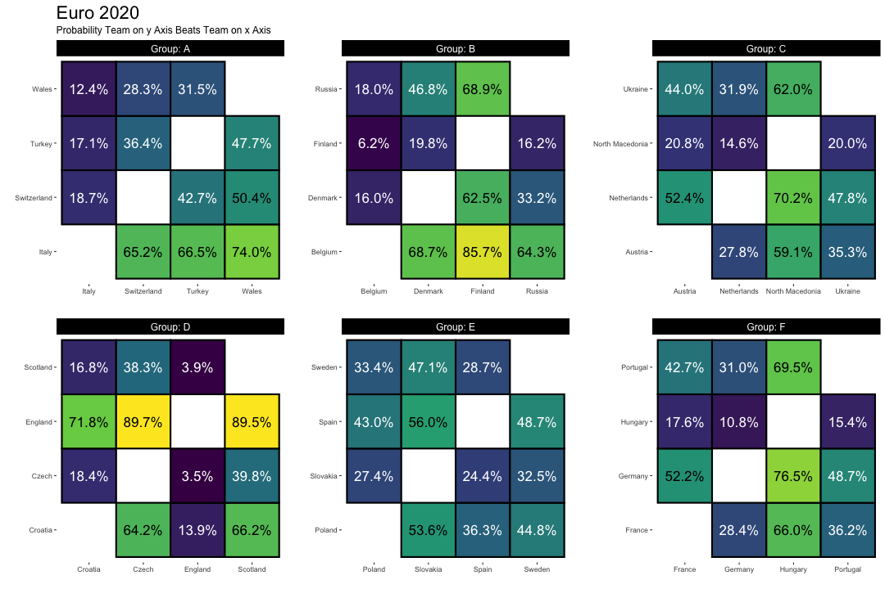

# Introduction

I remember Andrew Gelman talking about [a Stan model for world cup games](https://statmodeling.stat.columbia.edu/2014/07/13/stan-analyzes-world-cup-data/). When someone at work posted around a google sheets file for Euro 2020 match predictions, I thought it would be fun to make predictions using Stan.

This document is going to outline some of my investigations and findings.  I will talk about some of the data I use to fit the model, some model checking/limitations, and eventually make some predictions.

# The Model

Read Andrew's post for more.  In short, the model assumes teams $i$ and $j$ each have a latent ability $a_i$ and $a_j$ respectively.  The difference in scores for each team $y_i-y_j$ (I use raw differences rather than the square root as Gelman does for reasons I will get to) are assumed to come from a student t distribution with degrees of freedom $\nu$

$$ y_i- y_j \sim \operatorname{Student-t}(\nu,a_i - a_j, \sigma^2_y) \>.  $$

The abilities $a_{\cdot}$ are modeled hierarchically

$$ a_i \sim \operatorname{Normal}(\beta x, \sigma^2_a ) $$
Where $x$ is team $i$'s prior ranking according to UEFA and $\beta$ is the effect of the ranking on the latent ability.

Now, we need to place priors on $\sigma_a$, $\sigma_y$, $\nu$ and $\beta$ and we are off to the races.  See `models/euro_raw_diff.stan` for my model priors.  I haven't changed them much from Gelman's.

# Data

Prior rankings are found [here](#Prior rankings using points here https://www.fifa.com/fifa-world-ranking/ranking-table/men/
).  There is a column called "total points" which I use rather than the ordinal.  The reason is because the difference between the team ranked 1 and the team ranked 3 may not necessarily be twice the difference between teams ranked 1 and 2.  The points *appears* to be a more faithful representation of how much better one team is than another, but if I'm being honest I'm not sure how that column is calculated or if I am right. I will leave that to the reader to decide.

I fit the model on [UEFA qualifying round data](https://www.uefa.com/european-qualifiers/fixtures-results/#/dw/1276).  This makes the most sense to me, through granted the squads and coaches do not remain the same over time.  Using previous euro performance is dubious to me (though I do have qualifying data for euro 2016 so I could check).  Four years in between tournaments is a long time, and a lot has the potential to change.  Rather than jumping straight to the more complex model which includes time as an effect, I figured I would start with the simpler model and see how well it does this year.  If it does well, I can always extend it.

Let's fit the model now.

```r
knitr::opts_chunk$set(warning = F, cache = T, message = F)
```


```r
library(tidyverse)
library(readxl)
library(cmdstanr)
library(tidybayes)
library(posterior)
library(viridis)
library(bayesplot)
library(pROC)
cmdstanr::register_knitr_engine(override = F)

#Load in data
euro_data = read_csv('data/qualifying_round_games.csv') 

# Standardize the points data
ranking_data = read_csv('data/rankings.csv') %>% 
               mutate(prior_score = as.numeric(scale(pts))) %>% 
               arrange(team)

# extract data for model
teams = ranking_data$team
nteams = length(teams)
ngames = nrow(euro_data)
team1 = match(euro_data$team1, teams)
team2 = match(euro_data$team2, teams)
score1 = euro_data$score1
score2 = euro_data$score2
b_mean = 0 #prior mean for beta, I'm very skeptical these past rankings are very informative.
b_sd = 0.05 #prior sd for beta.
prior_score = ranking_data$prior_score

# Store data in a list to pass to Stan
model_data = list(
  nteams = nteams,
  ngames = ngames,
  team1 = team1,
  team2 = team2,
  score1 = score1,
  score2 = score2,
  prior_score = prior_score,
  b_mean = b_mean,
  b_sd = b_sd
)

# Instantiate model and run sampling.
model = cmdstan_model('models/euro_raw_dif.stan')
fit = model$sample(model_data, parallel_chains=4, seed=19920908, show_messages = F)
```

```
## Running MCMC with 4 parallel chains...
## 
## Chain 1 Iteration:    1 / 2000 [  0%]  (Warmup) 
## Chain 2 Iteration:    1 / 2000 [  0%]  (Warmup) 
## Chain 3 Iteration:    1 / 2000 [  0%]  (Warmup) 
## Chain 3 Iteration:  100 / 2000 [  5%]  (Warmup) 
## Chain 4 Iteration:    1 / 2000 [  0%]  (Warmup) 
## Chain 4 Iteration:  100 / 2000 [  5%]  (Warmup) 
## Chain 1 Iteration:  100 / 2000 [  5%]  (Warmup) 
## Chain 1 Iteration:  200 / 2000 [ 10%]  (Warmup) 
## Chain 1 Iteration:  300 / 2000 [ 15%]  (Warmup) 
## Chain 1 Iteration:  400 / 2000 [ 20%]  (Warmup) 
## Chain 2 Iteration:  100 / 2000 [  5%]  (Warmup) 
## Chain 2 Iteration:  200 / 2000 [ 10%]  (Warmup) 
## Chain 2 Iteration:  300 / 2000 [ 15%]  (Warmup) 
## Chain 3 Iteration:  200 / 2000 [ 10%]  (Warmup) 
## Chain 3 Iteration:  300 / 2000 [ 15%]  (Warmup) 
## Chain 4 Iteration:  200 / 2000 [ 10%]  (Warmup) 
## Chain 4 Iteration:  300 / 2000 [ 15%]  (Warmup) 
## Chain 2 Iteration:  400 / 2000 [ 20%]  (Warmup) 
## Chain 1 Iteration:  500 / 2000 [ 25%]  (Warmup) 
## Chain 2 Iteration:  500 / 2000 [ 25%]  (Warmup) 
## Chain 3 Iteration:  400 / 2000 [ 20%]  (Warmup) 
## Chain 4 Iteration:  400 / 2000 [ 20%]  (Warmup) 
## Chain 2 Iteration:  600 / 2000 [ 30%]  (Warmup) 
## Chain 3 Iteration:  500 / 2000 [ 25%]  (Warmup) 
## Chain 4 Iteration:  500 / 2000 [ 25%]  (Warmup) 
## Chain 1 Iteration:  600 / 2000 [ 30%]  (Warmup) 
## Chain 1 Iteration:  700 / 2000 [ 35%]  (Warmup) 
## Chain 2 Iteration:  700 / 2000 [ 35%]  (Warmup) 
## Chain 3 Iteration:  600 / 2000 [ 30%]  (Warmup) 
## Chain 3 Iteration:  700 / 2000 [ 35%]  (Warmup) 
## Chain 4 Iteration:  600 / 2000 [ 30%]  (Warmup) 
## Chain 4 Iteration:  700 / 2000 [ 35%]  (Warmup) 
## Chain 1 Iteration:  800 / 2000 [ 40%]  (Warmup) 
## Chain 1 Iteration:  900 / 2000 [ 45%]  (Warmup) 
## Chain 2 Iteration:  800 / 2000 [ 40%]  (Warmup) 
## Chain 2 Iteration:  900 / 2000 [ 45%]  (Warmup) 
## Chain 3 Iteration:  800 / 2000 [ 40%]  (Warmup) 
## Chain 3 Iteration:  900 / 2000 [ 45%]  (Warmup) 
## Chain 4 Iteration:  800 / 2000 [ 40%]  (Warmup) 
## Chain 4 Iteration:  900 / 2000 [ 45%]  (Warmup) 
## Chain 1 Iteration: 1000 / 2000 [ 50%]  (Warmup) 
## Chain 1 Iteration: 1001 / 2000 [ 50%]  (Sampling) 
## Chain 2 Iteration: 1000 / 2000 [ 50%]  (Warmup) 
## Chain 2 Iteration: 1001 / 2000 [ 50%]  (Sampling) 
## Chain 3 Iteration: 1000 / 2000 [ 50%]  (Warmup) 
## Chain 3 Iteration: 1001 / 2000 [ 50%]  (Sampling) 
## Chain 4 Iteration: 1000 / 2000 [ 50%]  (Warmup) 
## Chain 4 Iteration: 1001 / 2000 [ 50%]  (Sampling) 
## Chain 1 Iteration: 1100 / 2000 [ 55%]  (Sampling) 
## Chain 2 Iteration: 1100 / 2000 [ 55%]  (Sampling) 
## Chain 3 Iteration: 1100 / 2000 [ 55%]  (Sampling) 
## Chain 4 Iteration: 1100 / 2000 [ 55%]  (Sampling) 
## Chain 1 Iteration: 1200 / 2000 [ 60%]  (Sampling) 
## Chain 2 Iteration: 1200 / 2000 [ 60%]  (Sampling) 
## Chain 3 Iteration: 1200 / 2000 [ 60%]  (Sampling) 
## Chain 4 Iteration: 1200 / 2000 [ 60%]  (Sampling) 
## Chain 1 Iteration: 1300 / 2000 [ 65%]  (Sampling) 
## Chain 2 Iteration: 1300 / 2000 [ 65%]  (Sampling) 
## Chain 3 Iteration: 1300 / 2000 [ 65%]  (Sampling) 
## Chain 4 Iteration: 1300 / 2000 [ 65%]  (Sampling) 
## Chain 1 Iteration: 1400 / 2000 [ 70%]  (Sampling) 
## Chain 2 Iteration: 1400 / 2000 [ 70%]  (Sampling) 
## Chain 3 Iteration: 1400 / 2000 [ 70%]  (Sampling) 
## Chain 4 Iteration: 1400 / 2000 [ 70%]  (Sampling) 
## Chain 1 Iteration: 1500 / 2000 [ 75%]  (Sampling) 
## Chain 2 Iteration: 1500 / 2000 [ 75%]  (Sampling) 
## Chain 3 Iteration: 1500 / 2000 [ 75%]  (Sampling) 
## Chain 4 Iteration: 1500 / 2000 [ 75%]  (Sampling) 
## Chain 1 Iteration: 1600 / 2000 [ 80%]  (Sampling) 
## Chain 2 Iteration: 1600 / 2000 [ 80%]  (Sampling) 
## Chain 3 Iteration: 1600 / 2000 [ 80%]  (Sampling) 
## Chain 4 Iteration: 1600 / 2000 [ 80%]  (Sampling) 
## Chain 1 Iteration: 1700 / 2000 [ 85%]  (Sampling) 
## Chain 2 Iteration: 1700 / 2000 [ 85%]  (Sampling) 
## Chain 3 Iteration: 1700 / 2000 [ 85%]  (Sampling) 
## Chain 4 Iteration: 1700 / 2000 [ 85%]  (Sampling) 
## Chain 1 Iteration: 1800 / 2000 [ 90%]  (Sampling) 
## Chain 2 Iteration: 1800 / 2000 [ 90%]  (Sampling) 
## Chain 2 Iteration: 1900 / 2000 [ 95%]  (Sampling) 
## Chain 3 Iteration: 1800 / 2000 [ 90%]  (Sampling) 
## Chain 3 Iteration: 1900 / 2000 [ 95%]  (Sampling) 
## Chain 4 Iteration: 1800 / 2000 [ 90%]  (Sampling) 
## Chain 1 Iteration: 1900 / 2000 [ 95%]  (Sampling) 
## Chain 2 Iteration: 2000 / 2000 [100%]  (Sampling) 
## Chain 3 Iteration: 2000 / 2000 [100%]  (Sampling) 
## Chain 4 Iteration: 1900 / 2000 [ 95%]  (Sampling) 
## Chain 2 finished in 2.0 seconds.
## Chain 3 finished in 2.0 seconds.
## Chain 1 Iteration: 2000 / 2000 [100%]  (Sampling) 
## Chain 4 Iteration: 2000 / 2000 [100%]  (Sampling) 
## Chain 1 finished in 2.0 seconds.
## Chain 4 finished in 2.0 seconds.
## 
## All 4 chains finished successfully.
## Mean chain execution time: 2.0 seconds.
## Total execution time: 2.2 seconds.
```

```r
fit$cmdstan_diagnose()
```

```
## Processing csv files: /var/folders/bp/7wzcfkhj67l2f8d9mlr4zytc0000gn/T/RtmpvCgGkH/euro_raw_dif-202106132147-1-7991bf.csv, /var/folders/bp/7wzcfkhj67l2f8d9mlr4zytc0000gn/T/RtmpvCgGkH/euro_raw_dif-202106132147-2-7991bf.csv, /var/folders/bp/7wzcfkhj67l2f8d9mlr4zytc0000gn/T/RtmpvCgGkH/euro_raw_dif-202106132147-3-7991bf.csv, /var/folders/bp/7wzcfkhj67l2f8d9mlr4zytc0000gn/T/RtmpvCgGkH/euro_raw_dif-202106132147-4-7991bf.csv
## 
## Checking sampler transitions treedepth.
## Treedepth satisfactory for all transitions.
## 
## Checking sampler transitions for divergences.
## No divergent transitions found.
## 
## Checking E-BFMI - sampler transitions HMC potential energy.
## E-BFMI satisfactory for all transitions.
## 
## Effective sample size satisfactory.
## 
## Split R-hat values satisfactory all parameters.
## 
## Processing complete, no problems detected.
```
Stan doesn't complain about the model fitting (its a very simple model) so we are good to go.

# Model Checking

Above, I said I use the raw score difference in the model, where as Gelman uses

$$ \operatorname{sgn}(y_i- y_j)\sqrt{(y_i- y_j)} \sim \operatorname{Student-t}(\nu,a_i - a_j, \sigma^2_y) \>.  $$

Gelman provides a good rationale, but I find when I use this model then there is far far too much credence given to a draw. This model says the signed square root is student t, so in the model we have to square the draws and give them the right sign.  Check out the `generated quantites` blog of `models/euro_model_prior_scores_estimated_df.stan` for more.


Let's fit this model and do some posterior predictive checking.  You can see below that score differentials of 0 (draws) are far too prevelant from the model.  The result is a model which gives 50% probability to draws even though about 1 in 7 games end in a draw.


```r
gelman_model = model = cmdstan_model('models/euro_model_prior_scores_estimated_df.stan')
gelman_fit = gelman_model$sample(model_data, parallel_chains=4, seed=19920908 )
```

```
## Running MCMC with 4 parallel chains...
## 
## Chain 1 Iteration:    1 / 2000 [  0%]  (Warmup) 
## Chain 2 Iteration:    1 / 2000 [  0%]  (Warmup) 
## Chain 3 Iteration:    1 / 2000 [  0%]  (Warmup) 
## Chain 4 Iteration:    1 / 2000 [  0%]  (Warmup) 
## Chain 2 Iteration:  100 / 2000 [  5%]  (Warmup) 
## Chain 1 Iteration:  100 / 2000 [  5%]  (Warmup) 
## Chain 3 Iteration:  100 / 2000 [  5%]  (Warmup) 
## Chain 4 Iteration:  100 / 2000 [  5%]  (Warmup) 
## Chain 1 Iteration:  200 / 2000 [ 10%]  (Warmup) 
## Chain 2 Iteration:  200 / 2000 [ 10%]  (Warmup) 
## Chain 3 Iteration:  200 / 2000 [ 10%]  (Warmup) 
## Chain 4 Iteration:  200 / 2000 [ 10%]  (Warmup) 
## Chain 2 Iteration:  300 / 2000 [ 15%]  (Warmup) 
## Chain 3 Iteration:  300 / 2000 [ 15%]  (Warmup) 
## Chain 1 Iteration:  300 / 2000 [ 15%]  (Warmup) 
## Chain 4 Iteration:  300 / 2000 [ 15%]  (Warmup) 
## Chain 2 Iteration:  400 / 2000 [ 20%]  (Warmup) 
## Chain 3 Iteration:  400 / 2000 [ 20%]  (Warmup) 
## Chain 1 Iteration:  400 / 2000 [ 20%]  (Warmup) 
## Chain 4 Iteration:  400 / 2000 [ 20%]  (Warmup) 
## Chain 2 Iteration:  500 / 2000 [ 25%]  (Warmup) 
## Chain 3 Iteration:  500 / 2000 [ 25%]  (Warmup) 
## Chain 1 Iteration:  500 / 2000 [ 25%]  (Warmup) 
## Chain 2 Iteration:  600 / 2000 [ 30%]  (Warmup) 
## Chain 4 Iteration:  500 / 2000 [ 25%]  (Warmup) 
## Chain 3 Iteration:  600 / 2000 [ 30%]  (Warmup) 
## Chain 1 Iteration:  600 / 2000 [ 30%]  (Warmup) 
## Chain 2 Iteration:  700 / 2000 [ 35%]  (Warmup) 
## Chain 1 Iteration:  700 / 2000 [ 35%]  (Warmup) 
## Chain 3 Iteration:  700 / 2000 [ 35%]  (Warmup) 
## Chain 4 Iteration:  600 / 2000 [ 30%]  (Warmup) 
## Chain 2 Iteration:  800 / 2000 [ 40%]  (Warmup) 
## Chain 3 Iteration:  800 / 2000 [ 40%]  (Warmup) 
## Chain 4 Iteration:  700 / 2000 [ 35%]  (Warmup) 
## Chain 1 Iteration:  800 / 2000 [ 40%]  (Warmup) 
## Chain 2 Iteration:  900 / 2000 [ 45%]  (Warmup) 
## Chain 3 Iteration:  900 / 2000 [ 45%]  (Warmup) 
## Chain 1 Iteration:  900 / 2000 [ 45%]  (Warmup) 
## Chain 4 Iteration:  800 / 2000 [ 40%]  (Warmup) 
## Chain 2 Iteration: 1000 / 2000 [ 50%]  (Warmup) 
## Chain 2 Iteration: 1001 / 2000 [ 50%]  (Sampling) 
## Chain 1 Iteration: 1000 / 2000 [ 50%]  (Warmup) 
## Chain 1 Iteration: 1001 / 2000 [ 50%]  (Sampling) 
## Chain 3 Iteration: 1000 / 2000 [ 50%]  (Warmup) 
## Chain 3 Iteration: 1001 / 2000 [ 50%]  (Sampling) 
## Chain 4 Iteration:  900 / 2000 [ 45%]  (Warmup) 
## Chain 2 Iteration: 1100 / 2000 [ 55%]  (Sampling) 
## Chain 3 Iteration: 1100 / 2000 [ 55%]  (Sampling) 
## Chain 4 Iteration: 1000 / 2000 [ 50%]  (Warmup) 
## Chain 4 Iteration: 1001 / 2000 [ 50%]  (Sampling) 
## Chain 1 Iteration: 1100 / 2000 [ 55%]  (Sampling) 
## Chain 2 Iteration: 1200 / 2000 [ 60%]  (Sampling) 
## Chain 3 Iteration: 1200 / 2000 [ 60%]  (Sampling) 
## Chain 2 Iteration: 1300 / 2000 [ 65%]  (Sampling) 
## Chain 4 Iteration: 1100 / 2000 [ 55%]  (Sampling) 
## Chain 1 Iteration: 1200 / 2000 [ 60%]  (Sampling) 
## Chain 3 Iteration: 1300 / 2000 [ 65%]  (Sampling) 
## Chain 4 Iteration: 1200 / 2000 [ 60%]  (Sampling) 
## Chain 2 Iteration: 1400 / 2000 [ 70%]  (Sampling) 
## Chain 1 Iteration: 1300 / 2000 [ 65%]  (Sampling) 
## Chain 3 Iteration: 1400 / 2000 [ 70%]  (Sampling) 
## Chain 4 Iteration: 1300 / 2000 [ 65%]  (Sampling) 
## Chain 2 Iteration: 1500 / 2000 [ 75%]  (Sampling) 
## Chain 1 Iteration: 1400 / 2000 [ 70%]  (Sampling) 
## Chain 3 Iteration: 1500 / 2000 [ 75%]  (Sampling) 
## Chain 4 Iteration: 1400 / 2000 [ 70%]  (Sampling) 
## Chain 2 Iteration: 1600 / 2000 [ 80%]  (Sampling) 
## Chain 1 Iteration: 1500 / 2000 [ 75%]  (Sampling) 
## Chain 2 Iteration: 1700 / 2000 [ 85%]  (Sampling) 
## Chain 3 Iteration: 1600 / 2000 [ 80%]  (Sampling) 
## Chain 4 Iteration: 1500 / 2000 [ 75%]  (Sampling) 
## Chain 1 Iteration: 1600 / 2000 [ 80%]  (Sampling) 
## Chain 2 Iteration: 1800 / 2000 [ 90%]  (Sampling) 
## Chain 3 Iteration: 1700 / 2000 [ 85%]  (Sampling) 
## Chain 4 Iteration: 1600 / 2000 [ 80%]  (Sampling) 
## Chain 3 Iteration: 1800 / 2000 [ 90%]  (Sampling) 
## Chain 1 Iteration: 1700 / 2000 [ 85%]  (Sampling) 
## Chain 2 Iteration: 1900 / 2000 [ 95%]  (Sampling) 
## Chain 4 Iteration: 1700 / 2000 [ 85%]  (Sampling) 
## Chain 3 Iteration: 1900 / 2000 [ 95%]  (Sampling) 
## Chain 1 Iteration: 1800 / 2000 [ 90%]  (Sampling) 
## Chain 2 Iteration: 2000 / 2000 [100%]  (Sampling) 
## Chain 4 Iteration: 1800 / 2000 [ 90%]  (Sampling) 
## Chain 2 finished in 4.2 seconds.
## Chain 3 Iteration: 2000 / 2000 [100%]  (Sampling) 
## Chain 4 Iteration: 1900 / 2000 [ 95%]  (Sampling) 
## Chain 3 finished in 4.3 seconds.
## Chain 1 Iteration: 1900 / 2000 [ 95%]  (Sampling) 
## Chain 4 Iteration: 2000 / 2000 [100%]  (Sampling) 
## Chain 4 finished in 4.4 seconds.
## Chain 1 Iteration: 2000 / 2000 [100%]  (Sampling) 
## Chain 1 finished in 4.6 seconds.
## 
## All 4 chains finished successfully.
## Mean chain execution time: 4.4 seconds.
## Total execution time: 4.7 seconds.
```

```r
y = score1-score2
yrep = as_draws_matrix(gelman_fit$draws('yppc'))[1:100, ]

ppc_bars(y, yrep, prob=0.95)+xlim(-10, 10)
```




The model which uses the raw differences looks much much better, though not perfect.


```r
yrep = as_draws_matrix(fit$draws('yppc'))[1:100, ]

ppc_bars(y, yrep, prob=0.95)+xlim(-10, 10)
```



The reason the square root model over estimates the draws is because squaring a number smaller than 1 results in a smaller number smaller than 1. If the simulated score differential is smaller than 0.707 in absolute value, then squaring it make it smaller than 0.5 and hence the rounding (I round because scores are discrete) will pull it toward 0.

Speaking of draws, this model still does not handle draws well.  If one were to guess what the outcome of a game might be (a given team wins, loses, draws) then the most uncertain approach would be to make all outcomes equiprobable.  In the most charitable of cases (we know both teams latent abilities perfectly and $a_i-a_j=0$) the highest P(draw) can ever be is between 25% and 27%.


```r
# Generate draws from the posterior predictive when a_i - a_j=0
# i.e when two teams have identical ability.
# A priori, the result of the match should be P(A wins) = P(B wins) = P(Draw) = 1/3
# The model gets close, but even under ideal circumstances can not achieve this
sigma_y = fit$draws('sigma_y')
df = fit$draws('df')
ppc_draws = round(rt(length(sigma_y), df)*sigma_y)
ppc_result = case_when(ppc_draws>0~'Team A Wins', ppc_draws<0~'Team B Wins', T~'Draw')
prop.table(table(ppc_result))
```

```
## ppc_result
##        Draw Team A Wins Team B Wins 
##     0.27150     0.37625     0.35225
```


This means a model can't give large probability to a draw happening, and it can't say a draw is very unlikely to happen without putting too much confidence in one team winning.  This precludes statements like "A draw us unlikely to happen, but I am still uncertain as to who will win".  

What about coverage? What proportion of qualifying games have a score differential captured by a credible interval?  About 95% of 95% credible intervals capture the score differential (nice!) but I this is unsurprising.  I would be more concerned if this was not the case.  Andrew Gelman says something similar in his blog post.


```r
# How many score differentials in the data are captured by the model?
fit$draws('yppc') %>% 
  spread_draws(yppc[i]) %>% 
  median_qi() %>% 
  bind_cols(euro_data) %>% 
  mutate(dif = score1-score2,
         cov = (dif<.upper)&(dif>.lower)) %>% 
  pull(cov) %>% 
  mean
```

```
## [1] 0.9427481
```

Finally, what about predictive ability?  Mind you, any metrics computed here are essentially training performance, but hey good to check the model is learning something right? Let me make a couple little functions to handle some predictions we we might want to make.


```r
a = fit$draws('a') %>% as_draws_df
sigma_y = fit$draws('sigma_y')
est_df = fit$draws('df')

# Given two country names (e.g. Italy and Turkey),
# extract goal differential posterior draws from model
goal_diff = function(teamA, teamB, do_round=T){
  set.seed(0)
  ixa = match(teamA, teams)
  ixb = match(teamB, teams)
  ai = a[, ixa]
  aj = a[, ixb]
  random_outcome = (ai - aj) + rt(nrow(ai-ai), est_df)*sigma_y
  if(do_round){
    round(pull(random_outcome))
  }
  else{
    pull(random_outcome)
  }
  
  
}

# Estimate the probaility teamA beats teamB
prob_win = function(teamA, teamB){
  random_outcome = goal_diff(teamA, teamB)
  mean(random_outcome>0)
}

# Compute P(Team A wins), P(Team B wins), P(Draw) for two teams
predict = function(teamA, teamB){
  gd = goal_diff(teamA, teamB)
  outcome_space = tibble(outcome = c('A Wins', 'B Wins', 'Draw'),
                         result = c(1, -1, 0))
  
  gdr = case_when(gd<0~-1, gd>0~1, T~0)
  
  tibble(result = gdr) %>% 
    right_join(outcome_space) %>% 
    group_by(outcome) %>% 
    summarise(n = n()) %>% 
    mutate(n = n/sum(n)) %>% 
    spread(outcome, n)
  

}
```

Now, let's see if we can predict the winner in the training data.  Not being able to do this is a huge red flag.


```r
# Compute the probability team 1 wins in our training data
yhat = map2_dbl(euro_data$team1, euro_data$team2, prob_win)
# In which matches did team 1 actually win?
y = as.integer((score1>score2))

auc(multiclass.roc(y, yhat))
```

```
## Multi-class area under the curve: 0.918
```
On the training data, the model achieves an AUC of 0.918.  That's great, but no reason to bet the house on anything because remember this is training data.

Ok, that is enough model checking.  I understand the limitations enough to say "hey, let's have some fun".

# Making predictions

I will end this little document with a viz of how the group stages will play out.


```r
# Construct groups for predicting results of the group stage
group_a_teams = tibble(team = c('Italy','Switzerland','Turkey','Wales'), group = 'A')
group_b_teams = tibble(team = c('Belgium','Denmark','Finland','Russia'), group = 'B' )
group_c_teams = tibble(team = c('Austria','Netherlands','North Macedonia', 'Ukraine'), group = 'C')
group_d_teams = tibble(team = c('Croatia', 'Czech', 'England', 'Scotland'), group = 'D' )
group_e_teams = tibble(team = c('Poland', 'Slovakia','Spain', 'Sweden'), group = 'E' )
group_f_teams = tibble(team = c('France','Germany','Hungary','Portugal'), group = 'F')

# Combine individual group dataframes into a single dataframe.
groups = bind_rows(group_a_teams, group_b_teams, group_c_teams, group_d_teams, group_e_teams, group_f_teams) %>% 
         mutate(i = seq_along(team))


plot_data = full_join(groups, groups, by='group') %>% 
  filter(i.x!=i.y) %>%
  mutate(p_x_win = map2_dbl(team.x, team.y, prob_win)) %>% 
  rename(Group = group)

group_plot = plot_data %>% 
  ggplot(aes(team.y, team.x, fill = p_x_win))+
  geom_tile(size = 1, color = 'black')+
  geom_text(aes(label = scales::percent(p_x_win, accuracy = 0.1)), color = if_else(plot_data$p_x_win<0.5, 'white','black' ), size = 6)+
  facet_wrap(~Group, scales = 'free', labeller = label_both)+
  scale_fill_continuous(type='viridis',labels = scales::percent)+
  theme(aspect.ratio = 1,
        panel.background = element_blank(),
        strip.background = element_rect(fill = 'black'),
        strip.text = element_text(color = 'white', size = 12),
        plot.title = element_text(size = 22),
        plot.subtitle = element_text(size = 12),
        panel.spacing = unit(2, "lines")
        )+
  labs(y='', 
       x = '',
       title = 'Euro 2020',
       fill = 'Win Probability',
       subtitle = 'Probability Team on y Axis Beats Team on x Axis')+
  guides(fill = F)


group_plot
```




